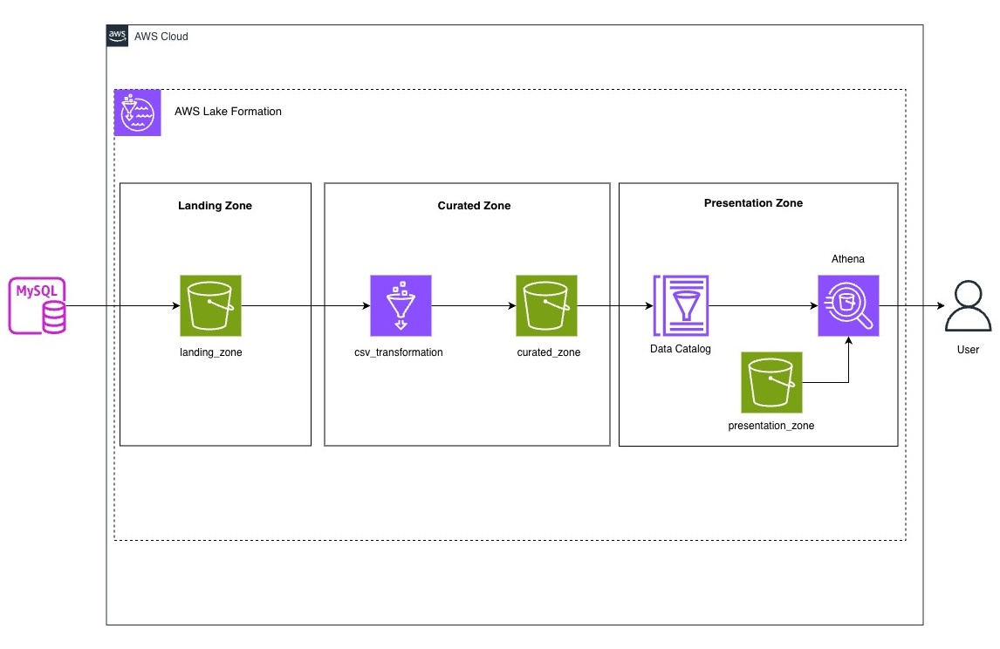

# ClassicModels Data Platform (AWS Medallion Architecture)

A cloud-based data engineering project built using **Terraform, AWS S3, AWS Glue, and Athena**, implementing a **medallion architecture (Landing → Curated → Presentation)** on the ClassicModels dataset.

---

## 🚀 Project Overview

This project simulates a modern data platform where transactional data from a relational database (ClassicModels) is ingested, transformed, and made available for analytics.

The pipeline is fully automated using **infrastructure as code (Terraform)** and serverless AWS services.

---

## 🏗️ Architecture



### 🔹 Landing Layer
- Raw CSV data extracted from the ClassicModels database
- Stored in Amazon S3 (landing zone)
- No transformations applied

### 🔹 Curated Layer
- AWS Glue jobs transform raw CSV into structured Parquet format
- Schema enforcement and metadata enrichment applied
- Stored in curated S3 zone

### 🔹 Presentation Layer
- Analytical datasets prepared for business use cases
- Queried using Amazon Athena
- Supports SQL-based analytics and reporting

---

## 🧰 Tech Stack

- **Cloud Provider:** AWS
- **Infrastructure as Code:** Terraform
- **Storage:** Amazon S3
- **ETL Processing:** AWS Glue (PySpark)
- **Query Engine:** Amazon Athena
- **Language:** Python (data extraction scripts)
---

## 📁 Project Structure

```plaintext
classicmodels-data-platform/
│
├── terraform/
│   ├── modules/
│       ├── infra/
│       ├── load_etl/
│       └── transform_etl/
│
├── data/
│   └── seed/                  
│
├── scripts/
│   ├── batch_load.py
│   ├── batch_extract.py
│   ├── batch_transform.py
│  
│
├── sql/
│   ├── athena_queries/
│
└── README.md
